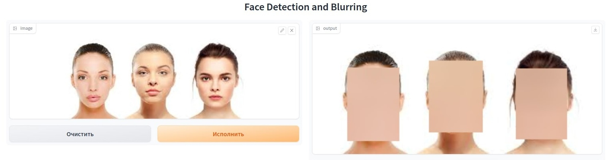

# Схема решения и метрики

## Решение с примером использования

Внизу представлен общий пайплайн решения:

Пример простого результата обработки картинки соответственно:

## Метрики машинного обучения

- Поскольку мы работаем с задачей детекции, необходимо работать над улучшением метрик качества детекции: IOU и mAp. Описание можно найти в [статье](https://analyticsindiamag.com/5-object-detection-evaluation-metrics-that-data-scientists-should-know/). Также можно смотреть эти метрики на специфических случаях (например, лицо смотрит не в анфас, а в какую-то другую сторону), поскольку нам важно понимать, насколько хорошо модель работает в реальных условиях.

- Скорость инференса как на CPU, так и на GPU с одной стороны для оценки ресурсов для работы модели, с другой для отбора "адекватных" моделей с точни зрения потребляемых ресурсов. Это можно измерять такими метриками как FPS (frames per second) и latency (время обработки одного кадра), которые можно получить из библиотеки [OpenVINO](https://docs.openvinotoolkit.org/latest/index.html). Также для этого использовать библиотеку [torchbenchmark](https://github.com/pytorch/benchmark).

## Метрики бизнеса

В случае детектирования лиц с целью анонимизации, для нас приоритетнее всего минимизовать ложноотрицательные предсказания (False Negative). Исходим из того, что для нас приоритетнее случайно замазать лицо условной куклы, чьё лицо случайно распозналось как человеческое (например, мы можем просто выбросить предупреждение, что на изображении найдены лица и предложить замазать/оставить как есть).

Наглядным кейсом в данном случае может быть пример мамочек, которые боятся сглаза детей по фотографии. Для них будет приоритетом именно **не допустить** публикации фотографии с лицом.